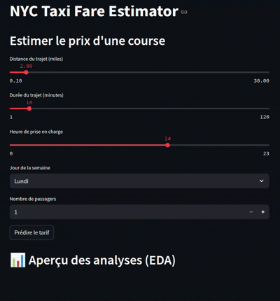

# Projet Data Science – Prédiction de Tarifs de Taxi à New York

## Membres du groupe
- DJONDANG Aoudou

## Description du projet
Ce projet vise à analyser et modéliser les données de trajets en taxi à New York en 2014, issues du dataset "New York City Taxi Trip Data" disponible sur Kaggle.  
L’objectif est de :
- Explorer les tendances spatio-temporelles des courses
- Construire un modèle de machine learning pour prédire le **tarif d’une course**
- Déployer un **dashboard interactif Streamlit** pour visualiser les résultats et interagir avec le modèle

## Dataset
- **Nom** : New York City Taxi Trip Data (2014)
- **Source** : Kaggle – https://www.kaggle.com/datasets/kentonnlp/2014-new-york-city-taxi-trips
- **Variables principales** :
    - Date & heure de prise en charge
    - Distance, durée, localisation GPS
    - Type de paiement, nombre de passagers
    - Montant total payé

## Lancer le dashboard

### 1. Installer les dépendances :
```bash
pip install -r requirements.txt
```

### 2. Lancer l'application Streamlit :
```bash
streamlit run app.py
```

## Dashboard en action (GIFs)


## Conclusions principales
- La **distance** et la **durée** du trajet sont les variables les plus importantes dans la prédiction.
- Le modèle **Random Forest** a surpassé la régression linéaire (R² > 0.9 sur un échantillon).
- Les **heures de forte affluence** sont entre 17h et 23h, surtout en semaine.
- Des visualisations géographiques ont permis d’identifier les zones à forte demande.

## Outils, Sources & Références

### Dataset
- [Kaggle - NYC Taxi Trips 2014](https://www.kaggle.com/datasets/kentonnlp/2014-new-york-city-taxi-trips)
#### NB :
- Le dataset est télécharger et stocker dans le repertoire de travail courant via le code suivant :

```python
path = kagglehub.dataset_download("kentonnlp/2014-new-york-city-taxi-trips")

print("Path to dataset files:", path)
```
### Outils utilisés
- Python, Pandas, Numpy
- Scikit-learn (modèles ML)
- Matplotlib, Seaborn (EDA)
- Folium (cartographie interactive)
- Streamlit (déploiement interactif)
- KaggleHub (téléchargement du dataset)
- Joblib (sauvegarde du modèle)
- [ChatGPT-4 / GPT-4o] pour l'assistance au développement, debug et structuration du projet

## Structure du projet
```
├── app.py                   # Application Streamlit
├── random_forest_model.pkl  # Modèle ML sauvegardé
├── requirements.txt         # Dépendances
├── Projet_Data_Science.ipynb # Notebook principal
├── README.md                # Ce fichier
```